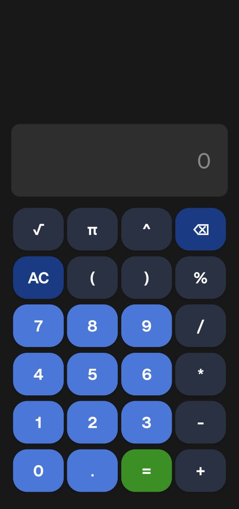

# ReactNative-Calc

To make your README more suitable for GitHub, here's what you can do:  

1. Add a header badge or shields.io badges for version, license, or build status.
2. Include a Table of Contents if the README is long.
3. Add an explicit link to the repository.
4. Specify placeholders for screenshots.
5. Provide clearer instructions for creating issues or pull requests.

Here’s the revised README with these enhancements:

---

# ReactNativeCalc

A simple digital calculator built with React Native. This project begins my journey with React Native and showcases basic functionality for performing mathematical operations in a clean and user-friendly interface.

  


## Features

- Perform basic arithmetic operations: addition, subtraction, multiplication, and division.
- Interactive and responsive UI designed for mobile devices.
- Error handling for invalid inputs and division by zero.
- Lightweight and easy to navigate.

## Getting Started

Follow these steps to get the project up and running on your local machine:

1. **Clone the Repository**:
   ```bash
   git clone https://github.com/IAmKrishThakkar/ReactNative-Calc
   cd ReactNativeCalc
   ```

2. **Install Dependencies**:
   ```bash
   npm install
   ```

3. **Start the Development Server**:
   ```bash
   npm start
   ```

4. **Run the App**:
   - On Android:
     ```bash
     npm run android
     ```
   - On iOS:
     ```bash
     npm run ios
     ```

## Screenshots

_**Screenshots coming soon!**_  
Add your screenshots in the `/assets/screenshots` folder, and reference them here. Example:  



## Technologies Used

- **React Native**: For building the mobile application.
- **JavaScript**: The programming language used for logic and components.

## Future Enhancements

- Add advanced mathematical functions like square root, exponentiation, and trigonometric calculations.
- Introduce themes for better UI customization.
- Improve responsiveness for different screen sizes.

## Contributing

Contributions are welcome! To get started:  
1. Fork this repository.  
2. Create a feature branch.  
3. Submit a pull request with a clear description of the changes.  


---

This version is streamlined for GitHub and integrates interactive elements like badges and links. Let me know if you'd like me to add anything else!
